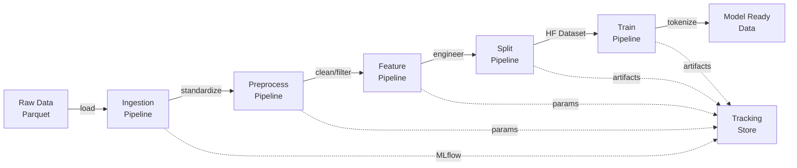

# Architecture Notes

- Use this file to record high-level structural decisions.
- Cross-reference detailed diagrams below; maintain this document as the single source of architectural truth.
- Whenever pipelines or module boundaries change, summarize the update here and link to supporting docs.
- **Last Updated**: 2025-10-17
- **Architecture Version**: 2.1.0

## 설계 철학 (대칭화 · 모듈화 · 순서화)

- **대칭화(Pattern)**: 동일한 본질의 기능은 유사한 패턴으로 작성하여 구조 파악 시 불필요한 인지 비용을 줄인다. 노드 함수, `pipeline.py` 구성, 문서 구조 모두 일관된 형식을 유지한다.
- **모듈화(Modularity)**: 노드 기반으로 기능을 분리하고, 각 모듈이 명확한 입력·출력 계약을 갖도록 유지한다. 파이프라인은 노드 조합만으로 복잡한 동작을 표현해야 한다.
- **순서화(Ordering)**: 폴더/파일 구조(정적)와 실행 흐름(동적)의 인과를 명확히 기록한다. 문서에는 단계별 순서, 데이터 흐름, 의존 관계를 명시한다.

### Dual-Ecosystem Architecture (이중 생태계 아키텍처)

본 프로젝트는 **Kedro 노드 생태계**와 **서브프로세스 생태계**라는 두 가지 실행 환경을 통합한 이중 구조를 채택합니다.

#### Layer 1: Kedro Node Ecosystem (케드로 노드 생태계)
- **철학**: 순방향(forward-progressive) 데이터 흐름, 단순 입출력 전달, 블록 단위 조합
- **제약**: 노드 간 양방향 통신 불가, 복잡한 상태 공유 불가, 단일 실행 스레드
- **장점**: 재현 가능성, 명확한 의존성, 시각화 가능, MLflow 자동 추적
- **구현 영역**:
  - 데이터 전처리 파이프라인 (ingestion → preprocess → feature)
  - 데이터 분할 및 직렬화 (split)
  - 토큰화 및 학습 준비 (train → tokenize_datasets)

#### Layer 2: Subprocess Ecosystem (서브프로세스 생태계)
- **철학**: 복잡한 양방향 상호작용, 멀티프로세스 협업, 동적 상태 관리
- **특징**: DeepSpeed 분산 학습, GPU 간 통신, 체크포인트 관리, 실시간 메트릭 수집
- **제약**: Kedro 추적 제한, 수동 MLflow 연동 필요, 서브프로세스 생명주기 관리
- **구현 영역**:
  - 분산 학습 실행 (`src/train/main_yaml.py`)
  - LoRA 최적화, 가중치 업데이트
  - 체크포인트 저장/복원
  - 평가 및 메트릭 수집

#### Boundary & Integration (경계 및 통합)

```
┌────────────────────────────────────────────────────────────────┐
│ Kedro Node Ecosystem (Layer 1)                                 │
│                                                                 │
│  ingestion → preprocess → feature → split → tokenize_datasets  │
│                                                                 │
│  [순방향 데이터 흐름, 단순 I/O 전달, 재현 가능성 보장]              │
└───────────────────────────┬────────────────────────────────────┘
                            │
                            ├─ launch_training (Kedro 노드)
                            │  • YAML 설정 생성
                            │  • MLflow 컨텍스트 전달 (env vars)
                            │  • subprocess.run() 호출
                            │
                            ▼
┌────────────────────────────────────────────────────────────────┐
│ Subprocess Ecosystem (Layer 2)                                 │
│                                                                 │
│  main_yaml.py → DeepSpeed 분산 학습                              │
│  • 양방향 GPU 통신 (NCCL)                                        │
│  • 동적 체크포인트 관리                                           │
│  • 실시간 메트릭 수집                                             │
│  • WeightedTrainer + GPUMemoryCallback                         │
│                                                                 │
│  [복잡한 상호작용, 멀티프로세스 협업, 상태 동기화]                   │
└───────────────────────────┬────────────────────────────────────┘
                            │
                            ├─ 학습 완료 후 제어권 반환
                            │  • 체크포인트 디렉토리 경로
                            │  • 메트릭 JSON 파일
                            │  • MLflow 아티팩트 로깅 (Kedro가 수행)
                            │
                            ▼
┌────────────────────────────────────────────────────────────────┐
│ Kedro Node Ecosystem (Layer 1 복귀)                            │
│                                                                 │
│  launch_training → MLflow 아티팩트 로깅 → 파이프라인 종료         │
└────────────────────────────────────────────────────────────────┘
```

#### Integration Mechanisms (통합 메커니즘)

1. **Configuration Contract (설정 계약)**
   - Kedro: `params:train` → YAML 직렬화 → `train_config.yml`
   - Subprocess: YAML 역직렬화 → 실행 설정 구성

2. **MLflow Context Passing (MLflow 컨텍스트 전달)**
   ```python
   # launch_training 노드 (Kedro Layer)
   env["MLFLOW_TRACKING_URI"] = tracking_uri
   env["MLFLOW_RUN_ID"] = active_run.info.run_id
   env["MLFLOW_NESTED_RUN"] = "true"  # 부모 run 보호
   ```

3. **Artifact Handoff (아티팩트 전달)**
   - Subprocess → 로컬 디렉토리 저장 (체크포인트, 메트릭)
   - Kedro 노드 → MLflow 아티팩트 로깅 (제어권 복귀 후)

4. **Error Propagation (에러 전파)**
   ```python
   subprocess.run(cmd, env=env, check=True)  # CalledProcessError 발생 시 Kedro 중단
   ```

#### Design Rationale (설계 근거)

| 요구사항 | Kedro 단독 | Subprocess 통합 | 선택 |
|---------|-----------|----------------|-----|
| 분산 학습 (DeepSpeed ZeRO) | ❌ 불가능 | ✅ 네이티브 지원 | **Subprocess** |
| 재현 가능성 | ✅ 자동 보장 | ⚠️ 수동 관리 | **Kedro** |
| 복잡한 GPU 통신 | ❌ 불가능 | ✅ NCCL/GLOO | **Subprocess** |
| 파이프라인 시각화 | ✅ kedro viz | ❌ 불가능 | **Kedro** |
| 체크포인트 재시작 | ⚠️ 제한적 | ✅ 유연함 | **Subprocess** |
| MLflow 자동 추적 | ✅ kedro-mlflow | ⚠️ 수동 연동 | **Kedro** |

→ **결론**: 두 생태계의 장점을 결합하여 **데이터 파이프라인은 Kedro**, **학습 실행은 Subprocess**로 분리

#### Common Utilities Bridge (공통 유틸리티 브리지)

`src/account_tax/utils/common.py`는 두 생태계를 연결하는 공통 함수 라이브러리:

```python
# Kedro 노드에서 사용
from account_tax.utils import compose_deepspeed_config, ensure_dir

# Subprocess에서 사용
from account_tax.utils.common import (
    build_training_arguments,
    WeightedTrainer,
    GPUMemoryCallback,
    compute_classification_metrics,
)
```

- **대칭화 원칙**: 동일한 함수 시그니처, 일관된 설정 패턴
- **모듈화 원칙**: 각 함수는 단일 책임, 명확한 입출력 계약
- **순서화 원칙**: `common.py` → Kedro 노드 → Subprocess 순서로 임포트

#### Current Implementation Analysis (현재 구현 분석)

##### Kedro Layer Functions (케드로 계층 함수)

**Pattern: Pure Data Transformation (순수 데이터 변환)**

모든 Kedro 노드는 다음 패턴을 따릅니다:

```python
def node_function(
    input_data: Type,
    params: Dict[str, Any]
) -> OutputType:
    """
    Pipeline Order: [파이프라인명] step [번호] ([순서])
    Role: [역할 설명]
    """
    # 1. 입력 검증
    # 2. 데이터 변환
    # 3. 로깅 (부수효과)
    # 4. 출력 반환
    return transformed_data
```

**예시: preprocess/nodes.py → clean_data**
```python
def clean_data(data: pd.DataFrame, clean_params: Dict[str, Any]) -> pd.DataFrame:
    initial_rows = len(data)

    # 단순 변환: 중복 제거
    if clean_params.get('remove_duplicates', True):
        data = data.drop_duplicates()

    # 단순 변환: null 제거
    dropna_columns = clean_params.get('dropna_columns', [])
    if dropna_columns:
        data = data.dropna(subset=dropna_columns)

    logger.info(f"Cleaning: {initial_rows} -> {len(data)} rows")
    return data
```

**특징**:
- ✅ 상태 없음 (stateless)
- ✅ 부수효과 최소화 (로깅만)
- ✅ 테스트 가능
- ✅ 재현 가능
- ❌ 복잡한 상호작용 불가능

##### Subprocess Layer Functions (서브프로세스 계층 함수)

**Pattern: Stateful Orchestration (상태 기반 오케스트레이션)**

서브프로세스 함수는 복잡한 상태 관리를 수행:

```python
def main() -> None:
    # 1. 설정 로드
    cfg = yaml.safe_load(open(args.config_yml))

    # 2. 상태 초기화
    model = load_model(cfg)
    trainer = create_trainer(model, cfg)

    # 3. 상태 기반 실행
    trainer.train(resume_from_checkpoint=checkpoint_path)

    # 4. 동적 체크포인트 관리
    if trainer.state.global_step % save_interval == 0:
        save_checkpoint(trainer, path)

    # 5. 분산 동기화
    torch.distributed.barrier()

    # 6. 정리 및 종료
    destroy_process_group()
```

**예시: train/main_yaml.py → main**
```python
def main() -> None:
    # 1. 설정 로드 및 시드 고정
    cfg = yaml.safe_load(open(args.config_yml))
    set_seed(cfg.get("seed", 42))

    # 2. 데이터셋 로드 (상태)
    dataset_dict = load_from_disk(cfg["data"]["tokenized_path"])

    # 3. 모델 초기화 (상태)
    model = AutoModelForSequenceClassification.from_pretrained(...)
    model = maybe_apply_lora(model, cfg["lora"])

    # 4. 트레이너 생성 (복잡한 상태)
    trainer = WeightedTrainer(
        model=model,
        train_dataset=train_dataset,
        eval_dataset=eval_dataset,
        class_weights=class_weights_tensor,  # 동적 가중치
        callbacks=[GPUMemoryCallback()],     # 실시간 모니터링
    )

    # 5. 학습 실행 (양방향 GPU 통신)
    trainer.train(resume_from_checkpoint=checkpoint_path)

    # 6. 분산 저장 (모든 rank 참여 필요)
    torch.distributed.barrier()  # 동기화 필수!
    model.save_pretrained(output_dir)
    torch.distributed.barrier()

    # 7. 프로세스 그룹 정리
    torch.distributed.destroy_process_group()
```

**특징**:
- ✅ 복잡한 상태 관리
- ✅ 양방향 통신 (GPU 간)
- ✅ 동적 체크포인트
- ✅ 실시간 모니터링
- ❌ Kedro 추적 불가
- ❌ 재현성 수동 관리 필요

##### Bridge Node: launch_training (브리지 노드)

**Pattern: Ecosystem Handoff (생태계 전환)**

`launch_training`은 두 생태계를 연결하는 특수 노드:

```python
def launch_training(
    tokenized_dataset_path: str,    # Kedro 출력
    train_params: Dict[str, Any],   # Kedro 파라미터
) -> Dict[str, Any]:                # Kedro 출력
    """Kedro → Subprocess 전환 노드"""

    # 1. YAML 설정 직렬화 (Kedro → Subprocess)
    config_path = write_yaml_config(train_params, tokenized_dataset_path)

    # 2. MLflow 컨텍스트 추출 및 환경변수 전달
    env = os.environ.copy()
    if mlflow.active_run():
        env["MLFLOW_RUN_ID"] = mlflow.active_run().info.run_id
        env["MLFLOW_NESTED_RUN"] = "true"

    # 3. 서브프로세스 실행 (생태계 전환!)
    cmd = ["deepspeed", "--num_gpus", str(num_gpus), "src/train/main_yaml.py",
           "--config_yml", str(config_path)]
    subprocess.run(cmd, env=env, check=True)

    # 4. 제어권 복귀 후 MLflow 아티팩트 로깅 (Kedro Layer)
    if mlflow.active_run():
        mlflow.log_artifacts(output_dir, artifact_path="final_model")

    # 5. Kedro 출력 형식으로 반환
    return {"config_path": str(config_path), "metrics": load_metrics()}
```

**특징**:
- ✅ Kedro 노드 계약 준수 (입력/출력)
- ✅ Subprocess 실행 및 에러 전파
- ✅ MLflow 컨텍스트 보존
- ✅ 아티팩트 생명주기 관리
- ⚠️ 동기 실행 (블로킹)

##### Function Inventory by Ecosystem (생태계별 함수 목록)

| 함수 위치 | 함수명 | 생태계 | 역할 | 상태 |
|---------|-------|--------|-----|-----|
| `pipelines/ingestion/nodes.py` | `load_data` | Kedro | 데이터 로드 | Stateless |
| `pipelines/preprocess/nodes.py` | `clean_data` | Kedro | 중복/null 제거 | Stateless |
| `pipelines/feature/nodes.py` | `build_features` | Kedro | 피처 생성 | Stateless |
| `pipelines/split/nodes.py` | `create_dataset` | Kedro | HF Dataset 변환 | Stateless |
| `pipelines/train/nodes.py` | `tokenize_datasets` | Kedro | 토큰화 | Stateless |
| `pipelines/train/nodes.py` | `launch_training` | **Bridge** | 생태계 전환 | Hybrid |
| `train/main_yaml.py` | `main` | Subprocess | 분산 학습 실행 | Stateful |
| `utils/common.py` | `WeightedTrainer` | Shared | 가중치 손실 계산 | Stateful |
| `utils/common.py` | `build_training_arguments` | Shared | TrainingArguments 생성 | Stateless |
| `utils/common.py` | `GPUMemoryCallback` | Subprocess | GPU 모니터링 | Stateful |

## Change Log

### 2025-10-17 · Dual-Ecosystem Architecture Documentation v2.1
- Added comprehensive dual-ecosystem architecture documentation
- Documented Kedro Layer vs Subprocess Layer design philosophy
- Analyzed current implementation patterns and function inventory
- Added integration mechanisms and design rationale
- Documented bridge node pattern (`launch_training`)
- Updated architecture version to 2.1.0

### 2025-09-29 · Architecture Documentation Update v2.0
- Corrected pipeline structure: 5 main pipelines (ingestion → preprocess → feature → split → train), not 10 stages
- Added comprehensive Package Version Management section
- Updated function inventory tables to match actual implementations
- Added MLflow integration architecture details
- Documented evaluation pipeline status and missing implementations
- Added system-wide compatibility matrix

### 2025-09-24 · Dataset 리팩터링

- Feature 파이프라인 마지막 노드를 `prepare_dataset_inputs`로 단순화하여 `base_table`만 반환하도록 변경.
- Split 파이프라인에 `create_dataset`을 추가해 HuggingFace `Dataset` 생성과 라벨 슬롯 구성을 담당하도록 이동.
- `serialize_for_nlp`가 `retain_columns` 옵션을 사용해 `text`, `labels`, `acct_code`만 유지하도록 정리.
- 상세 흐름과 함수 목록은 아래 “세부 아키텍처” 섹션을 확인하세요.

## Pipeline Status & Boundaries

| Pipeline | Status | Notes |
|----------|--------|-------|
| Ingestion | ✅ Complete | Raw parquet → standardized frame |
| Preprocess | ✅ Complete | Clean/filter/normalize + missing value unification |
| Feature | ✅ Complete | Date/holiday features, selection |
| Split | ✅ Complete | HF Dataset creation, labelize, serialization, token diagnostics |
| Train | ⚠️ In progress | LoRA/Deepspeed training integration pending |
| Inference | ⏳ Planned | Mirrors tokenization + model loading |

### Split 전 · 후 경계

```
┌─────────────────────────────┐  Split 이전 (공용 데이터 생성)
│ Ingestion ─ Preprocess ─ Feature ─ (Scaling) │
│  • 결측치/코드/수치 정규화
│  • 파생 피처 생성
└────────────┬────────────────┘
             ↓ base_table (공유)
┌─────────────────────────────┐  Split 이후 (학습/실험 영역)
│ create_dataset → to_hf_and_split → labelize_and_cast │
│ serialize_for_nlp → analyze_token_lengths → export_*  │
└─────────────────────────────┘
```

- **Split 이전 파이프라인**은 재사용 가능한 DataFrame(스케일링 포함)을 만드는 데 집중합니다.
- **Split 이후 파이프라인**은 실험마다 바뀌는 요소(Split 비율, 라벨 정수화, 텍스트 직렬화, 토큰 진단, 학습 설정)를 담당합니다.
- `train_pipeline.yml`의 `split.*` 파라미터로 동일 입력에 대해 여러 학습 버전을 유연하게 관리할 수 있습니다.

## Package Version Management

### Core Dependencies Matrix

#### Python Runtime
- **Required**: Python >= 3.12, < 3.14
- **Tested**: Python 3.12.x, 3.13.x
- **Rationale**: Balance between modern features and ecosystem compatibility

#### Framework Stack

| Package | Version | Purpose | Compatibility Notes |
|---------|---------|---------|--------------------|
| **Kedro** | 1.0.0 (exact) | Pipeline orchestration | Major version pinned for stability |
| **kedro-datasets** | >=8.1.0 | Extended dataset types | Includes pandas support |
| **kedro-mlflow** | >=1.0.0, <1.1.0 | MLflow integration | Tight version range for API stability |
| **kedro-viz** | 12.0.0 (exact) | Pipeline visualization | Fixed to prevent ipython conflicts |

#### Data Processing Stack

| Package | Version | Purpose | Compatibility Notes |
|---------|---------|---------|--------------------|
| **pandas** | >=2.3.2 | DataFrame operations | Latest 2.x for performance |
| **pyarrow** | >=19.0.0, <20.0.0 | Parquet I/O | Major version constraint |
| **PySpark** | >=4.0.1 | Large-scale processing | 4.x for Spark 3.x compatibility |
| **numpy** | >=1.21.0 | Numerical operations | Compatible with pandas 2.x |

#### ML/AI Stack

| Package | Version | Purpose | Compatibility Notes |
|---------|---------|---------|--------------------|
| **scikit-learn** | >=1.7.1 | ML utilities | Latest for evaluation metrics |
| **datasets** | >=3.0.0, <3.1.0 | HuggingFace datasets | Major version constraint |
| **mlflow** | >=2.22, <3.0 | Experiment tracking | 2.x for stability |
| **mlflow-skinny** | >=2.22, <3.0 | Lightweight MLflow | Must match mlflow version |

#### Development Stack

| Package | Version | Purpose | Compatibility Notes |
|---------|---------|---------|--------------------|
| **ipython** | 8.26.0 (exact) | Interactive shell | <9.0 for kedro-viz compatibility |
| **jupyter** | Latest | Notebooks | Via jupyterlab>=4.4.7 |
| **holidays** | >=0.81 | Holiday features | For date engineering |

### Version Conflict Resolution

1. **IPython < 9.0 constraint**: Required by kedro-viz 12.0.0 to prevent visualization conflicts
2. **PyArrow 19.x**: Pinned to major version for Parquet format stability
3. **MLflow 2.x**: Avoiding 3.x migration until ecosystem matures
4. **Datasets 3.0.x**: Minor version constraint for HuggingFace API stability

### Upgrade Path Recommendations

- **Q1 2026**: Evaluate Kedro 2.x migration when ecosystem stabilizes
- **Q2 2026**: Consider MLflow 3.x after plugin compatibility verified
- **Continuous**: Monitor pyarrow for performance improvements in 20.x

## 세부 아키텍처

### System Architecture Overview



### Block Architecture Principles

설계자는 폴더 → 파일 → 함수 단위의 블록 구성을 유지하면서 데이터 계약과 의존 관계를 추적합니다. 본 문서는 현재 구현 상태를 반영하며, 모든 함수의 책임과 흐름을 `대분류/중분류/함수이름/역할/입력/출력/후속블록` 기준으로 관리합니다.

#### 1. 파이프라인 아키텍처 개요

##### 1.1 Pipeline Structure (5 Main Pipelines)
```
Ingestion → Preprocess → Feature → Split → Train
   ↓           ↓           ↓         ↓       ↓
[3 nodes]   [4 nodes]   [4 nodes] [5 nodes] [2 nodes]
```

##### 1.2 Registered Pipeline Combinations
- **`__default__`**: Alias for `full_preprocess` (Ingestion → Split)
- **`full_preprocess`**: ingestion + preprocess + feature + split
- **`full`**: full_preprocess + train (complete pipeline)
- **`data_prep`**: ingestion + preprocess + feature (pre-split preparation)
- **Individual**: `ingestion`, `preprocess`, `feature`, `split`, `train`
- **Disabled**: `evaluation` (missing node implementations)

##### 1.3 Data Flow Architecture
- **Input**: `raw_account_data` (Parquet) → pandas.DataFrame
- **Processing**: DataFrame maintained through feature engineering
- **Transformation**: HuggingFace Dataset creation at split stage
- **Output**: `trainer_ready_data` (tokenized DatasetDict)

##### 1.4 MLflow Integration Points
- **Artifact Storage**: `MlflowArtifactDataset` for `prepared_datasets_mlflow`, `text_datasets_mlflow`
- **Parameter Logging**: Automatic from parameters/*.yml files
- **Experiment Tracking**: Via `account_tax_experiment` with random run names
- **Tracking Store**: Local `mlruns/` directory

#### 2. 데이터 계약 핵심
- 입력 원천: `raw_account_data` (`data/01_raw/row_data.parquet`) → `pandas.DataFrame`
- 전처리: `standardized_data`~`validated_data`까지 `DataFrame` 유지, 파라미터는 `conf/base/parameters.yml`의 `preprocess.*`
- 특성화: `prepare_dataset_inputs`가 `base_table`(`DataFrame`)을 제공하며 라벨 슬롯은 Split 단계에서 관리
- 분할: `create_dataset`이 HF `Dataset`과 라벨 슬롯을 생성하고, `to_hf_and_split`이 층화 분할을 수행, `labelize_and_cast`가 `ClassLabel` 스키마와 `label_metadata`를 부착해 `prepared_datasets`로 전달
- 학습 준비: `serialize_for_nlp`에서 텍스트 직렬화 → `tokenize_datasets`에서 토큰화 → `prepare_for_trainer`가 `trainer_ready_data`(datasets, collator, model_config)를 최종 산출

#### 3. Pipeline Node Documentation

## Ingestion Pipeline (3 nodes)

### 1. **load_data**
   - **입력**: `raw_data: pd.DataFrame` (from raw_account_data parquet file)
   - **출력**: `validated_raw_data: pd.DataFrame` (validated non-empty DataFrame)
   - **설명**: Loads raw accounting data from parquet file and validates it's not empty. Logs data shape and columns for monitoring.
   - **후속블록**: standardize_columns

### 2. **standardize_columns**
   - **입력**: `data: pd.DataFrame` (validated_raw_data)
   - **출력**: `standardized_data: pd.DataFrame` (with English column names)
   - **설명**: Standardizes Korean column names to English using predefined mapping. Handles 54 column mappings including accounting codes, party information, and tax fields.
   - **후속블록**: extract_metadata, clean_data

### 3. **extract_metadata**
   - **입력**: `data: pd.DataFrame` (standardized_data)
   - **출력**: `metadata: Dict[str, Any]` (statistics and schema info)
   - **설명**: Extracts comprehensive metadata including row/column counts, data types, memory usage, null counts, and column type categorization.
   - **후속블록**: External monitoring/logging

## Preprocess Pipeline (4 nodes)

### 1. **clean_data**
   - **입력**: `data: pd.DataFrame`, `clean_params: Dict` (from params:preprocess.clean)
   - **출력**: `cleaned_data: pd.DataFrame`
   - **설명**: Removes duplicate rows and handles missing values. Drops rows with nulls in critical columns specified in dropna_columns parameter.
   - **후속블록**: filter_data

### 2. **filter_data**
   - **입력**: `data: pd.DataFrame`, `filter_params: Dict` (from params:preprocess.filter)
   - **출력**: `filtered_data: pd.DataFrame`
   - **설명**: Excludes unnecessary columns specified in exclude_columns parameter. Typically removes id, created_at, batch_no columns.
   - **후속블록**: normalize_value

### 3. **normalize_value**
   - **입력**: `df: pd.DataFrame`, `code_mappings: Optional[Dict]`
   - **출력**: `normalized_data: pd.DataFrame`
   - **설명**: Converts code values to human-readable text. Maps VAT message codes, document types, and party type codes to meaningful labels.
   - **후속블록**: validate_data

### 4. **validate_data**
   - **입력**: `data: pd.DataFrame`, `params: Dict`
   - **출력**: `validated_data: pd.DataFrame`
   - **설명**: Applies business rule validation. Filters by amount thresholds and validates date formats, removing invalid records.
   - **후속블록**: build_features

### 5. **normalize_missing_values** (optional, not in pipeline)
   - **입력**: `data: pd.DataFrame`, `placeholders: Dict`
   - **출력**: `normalized_data: pd.DataFrame`
   - **설명**: Standardizes missing values with appropriate placeholders per data type (categorical: "__missing__", numeric: 0, etc.).
   - **후속블록**: Not currently integrated

## Feature Pipeline (4 nodes)

### 1. **build_features**
   - **입력**: `data: pd.DataFrame`, `params: Dict` (from params:feature.engineering)
   - **출력**: `feature_data: pd.DataFrame`
   - **설명**: Creates derived features including holiday features. Calls add_holiday_features internally to add day_type column.
   - **후속블록**: select_features

### 2. **add_holiday_features** (helper function)
   - **입력**: `df: pd.DataFrame`, `date_column: str`
   - **출력**: `df: pd.DataFrame` (with day_type column)
   - **설명**: Adds day_type column marking weekends and Korean public holidays as 'holiday', others as 'workday'.
   - **후속블록**: Called within build_features

### 3. **select_features**
   - **입력**: `data: pd.DataFrame`, `params: Dict` (from params:feature.selection)
   - **출력**: `selected_features: pd.DataFrame`
   - **설명**: Selects specific features and label columns in configured order. Typically selects 24 features + 1 label column.
   - **후속블록**: prepare_dataset_inputs

### 4. **prepare_dataset_inputs**
   - **입력**: `data: pd.DataFrame`, `params: Dict` (from params:feature.dataset_conversion)
   - **출력**: `base_table: pd.DataFrame`
   - **설명**: Prepares cleaned base table for HuggingFace Dataset conversion. Removes null labels and duplicates, logs unique label count.
   - **후속블록**: create_dataset

## Split Pipeline (6 main nodes + 3 helpers)

### Helper Functions

#### **_initialize_label_slots** (helper)
   - **입력**: `max_classes: int`, `dummy_prefix: str`
   - **출력**: `List[str]` (dummy label slots)
   - **설명**: Creates deterministic dummy label slots like ["dummy1", "dummy2", ...] up to max_classes.

#### **_upsert_labels_into_slots** (helper)
   - **입력**: `names: List[str]`, `new_labels: List[str]`, `dummy_prefix: str`
   - **출력**: `names: List[str]` (updated with real labels)
   - **설명**: Replaces dummy slots with real labels while preserving index positions.

#### **make_label2id** / **make_id2label** (helpers)
   - **입력**: `names: List[str]`
   - **출력**: `Dict[str, int]` or `Dict[int, str]`
   - **설명**: Creates bidirectional mappings between label names and integer IDs.

### Main Nodes

### 1. **create_dataset**
   - **입력**: `base_table: pd.DataFrame`, `params: Dict` (from params:split)
   - **출력**: `dataset: Dataset`, `names: List[str]`
   - **설명**: Creates HuggingFace Dataset from pandas DataFrame and initializes label slot system with max_classes slots.
   - **후속블록**: to_hf_and_split

### 2. **to_hf_and_split**
   - **입력**: `dataset: Dataset`, `label_col: str`, `seed: int`, `test_size: float`, `val_size: float`
   - **출력**: `splits: DatasetDict` (train/valid/test)
   - **설명**: Performs stratified train/validation/test split. Falls back to random split if stratification fails.
   - **후속블록**: labelize_and_cast

### 3. **labelize_and_cast**
   - **입력**: `splits: DatasetDict`, `names: List[str]`, `label_col: str`, `dummy_label: str`, `num_proc: int`
   - **출력**: `labeled_datasets: DatasetDict` (with integer labels and ClassLabel schema)
   - **설명**: Maps string labels to integers and applies ClassLabel schema. Attaches label_metadata to DatasetDict.
   - **후속블록**: serialize_for_nlp

### 4. **serialize_for_nlp**
   - **입력**: `dataset_dict: DatasetDict`, `params: Dict` (from params:train.serialization)
   - **출력**: `text_datasets: DatasetDict` (with text column)
   - **설명**: Serializes structured data into text format for NLP. Creates "column: value" format strings, retains only text and labels columns.
   - **후속블록**: analyze_token_lengths or tokenize_datasets

### 5. **analyze_token_lengths** (optional diagnostic)
   - **입력**: `dataset_dict: DatasetDict`, `tokenization_params: Dict`, `diagnostics_params: Dict`
   - **출력**: `dataset_dict: DatasetDict`, `report: Dict` (token statistics)
   - **설명**: Generates token length statistics and samples. Logs percentiles and mean/max token counts to MLflow.
   - **후속블록**: tokenize_datasets

### 6. **export_prepared_partitions** / **export_text_partitions**
   - **입력**: `dataset_dict: DatasetDict`
   - **출력**: `partitions: Dict[str, pd.DataFrame]`
   - **설명**: Converts DatasetDict splits back to partitioned pandas DataFrames for storage.
   - **후속블록**: MLflow artifact storage

## Train Pipeline (6 implemented nodes, 2 in pipeline)

### 1. **tokenize_datasets**
   - **입력**: `dataset_dict: DatasetDict`, `params: Dict` (from params:train.tokenization)
   - **출력**: `tokenized_datasets: DatasetDict`, `metadata: Dict`
   - **설명**: Tokenizes text data using HuggingFace tokenizer. Produces input_ids and attention_mask, removes text column to save memory.
   - **후속블록**: load_model or prepare_trainer

### 2. **load_model** (not in pipeline)
   - **입력**: `tokenized_data: DatasetDict`, `params: Dict` (from params:train.model)
   - **출력**: `model: AutoModelForSequenceClassification`, `metadata: Dict`
   - **설명**: Loads pre-trained model with proper configuration. Infers num_labels from data, enables gradient checkpointing, handles device mapping.
   - **후속블록**: apply_optimization

### 3. **apply_optimization** (not in pipeline)
   - **입력**: `model: Any`, `params: Dict` (from params:train.optimization)
   - **출력**: `optimized_model: Any`, `metadata: Dict`
   - **설명**: Applies LoRA optimization and/or torch.compile. Reduces trainable parameters from billions to millions with LoRA.
   - **후속블록**: prepare_trainer

### 4. **prepare_trainer** (in pipeline as prepare_for_trainer)
   - **입력**: `model: Any`, `tokenized_data: DatasetDict`, `params: Dict`
   - **출력**: `trainer_components: Dict`, `metadata: Dict`
   - **설명**: Prepares HuggingFace Trainer with all configurations. Sets up data collator, training arguments, DeepSpeed config, and metrics computation.
   - **후속블록**: train_model

### 5. **train_model** (not in pipeline)
   - **입력**: `trainer_components: Dict`, `params: Dict`
   - **출력**: `model: Any`, `metrics: Dict`, `artifacts: Dict`
   - **설명**: Executes model training using HuggingFace Trainer. Saves final model and tokenizer, returns training metrics.
   - **후속블록**: evaluate_model

### 6. **evaluate_model** (not in pipeline)
   - **입력**: `trainer_components: Dict`, `params: Dict`
   - **출력**: `metrics: Dict`, `artifacts: Dict`
   - **설명**: Evaluates trained model on validation and test sets. Generates predictions and confusion matrices if requested.
   - **후속블록**: Model deployment or further analysis

## Evaluation Pipeline (2 implemented, 4 missing)

### Implemented Nodes

### 1. **evaluate_predictions**
   - **입력**: `y_true: pd.Series`, `y_pred: pd.Series`
   - **출력**: `metrics: Dict` (accuracy, precision, recall, f1, confusion matrix)
   - **설명**: Calculates classification metrics using sklearn. Computes accuracy, precision, recall, F1 score with weighted averaging.
   - **상태**: ✅ Implemented but not connected to pipeline

### 2. **calculate_tax_impact**
   - **입력**: `predictions: pd.DataFrame` (with actual and predicted tax categories)
   - **출력**: `impact: Dict` (misclassified_amount, percentage, category breakdown)
   - **설명**: Estimates financial impact of tax misclassifications. Calculates misclassified amounts and percentages by category.
   - **상태**: ✅ Implemented but not connected to pipeline

### Missing Nodes (defined in pipeline but not implemented)

### 3. **evaluate_classification_model** ❌
   - **Expected 입력**: `y_test`, `y_pred`, `y_proba`
   - **Expected 출력**: `classification_metrics`
   - **설명**: Should evaluate classification model performance
   - **상태**: ❌ Pipeline expects this but node not implemented

### 4. **evaluate_tax_classification** ❌
   - **Expected 입력**: `test_predictions`, `tax_categories`
   - **Expected 출력**: `tax_metrics`
   - **설명**: Should evaluate tax-specific classification accuracy
   - **상태**: ❌ Pipeline expects this but node not implemented

### 5. **calculate_business_metrics** ❌
   - **Expected 입력**: `test_predictions`, `test_actuals`
   - **Expected 출력**: `business_metrics`
   - **설명**: Should calculate business impact metrics
   - **상태**: ❌ Pipeline expects this but node not implemented

### 6. **generate_evaluation_report** ❌
   - **Expected 입력**: `classification_metrics`, `tax_metrics`, `model_info`
   - **Expected 출력**: `evaluation_report`
   - **설명**: Should generate comprehensive evaluation report
   - **상태**: ❌ Pipeline expects this but node not implemented

## Utility Functions (not integrated into pipelines)

### 1. **categorize_accounts**
   - **입력**: `df: pd.DataFrame`, `account_mapping: Dict`
   - **출력**: `df: pd.DataFrame` (with account_category column)
   - **설명**: Maps accounts to categories based on provided mapping dictionary. Adds account_category column to DataFrame.
   - **상태**: ⚠️ Implemented but unused

### 2. **calculate_tax_categories**
   - **입력**: `df: pd.DataFrame`
   - **출력**: `df: pd.DataFrame` (with tax_category column)
   - **설명**: Derives tax categories based on keyword matching in account descriptions. Creates tax_category column.
   - **상태**: ⚠️ Implemented but unused

### 3. **aggregate_by_period**
   - **입력**: `df: pd.DataFrame`, `period_column: str`, `aggregation_level: str`
   - **출력**: `df: pd.DataFrame` (with period column)
   - **설명**: Aggregates data by time period (daily/weekly/monthly/quarterly/yearly). Adds period column for grouping.
   - **상태**: ⚠️ Implemented but unused

## System Registry & Entry Points

### 1. **register_pipelines** (pipeline_registry.py)
   - **입력**: None
   - **출력**: `Dict[str, Pipeline]` (all registered pipelines)
   - **설명**: Central registration point for all pipelines. Defines __default__, full_preprocess, full, data_prep, and individual pipeline mappings.
   - **후속블록**: Kedro CLI commands

### 2. **main** (__main__.py)
   - **입력**: CLI arguments
   - **출력**: Exit code (0 for success)
   - **설명**: Entry point for Kedro session execution. Handles kedro run and other CLI commands.
   - **후속블록**: Terminal/shell execution

#### 4. Architecture Health Check

##### 4.1 Implementation Status
| Component | Status | Notes |
|-----------|--------|-------|
| Ingestion Pipeline | ✅ Complete | 3 nodes fully implemented |
| Preprocess Pipeline | ✅ Complete | 4 nodes with business rules |
| Feature Pipeline | ✅ Complete | 4 nodes including holidays |
| Split Pipeline | ✅ Complete | 5 nodes with HF integration |
| Train Pipeline | ✅ Complete | 2 nodes for tokenization |
| Evaluation Pipeline | ⚠️ Partial | 2/6 nodes implemented |
| Utils Module | ⚠️ Unused | 3 functions not integrated |

##### 4.2 Critical Issues
1. **Evaluation Pipeline Gaps**:
   - Missing: `evaluate_classification_model`, `evaluate_tax_classification`
   - Missing: `generate_evaluation_report`, `calculate_business_metrics`
   - Impact: Cannot run evaluation pipeline without implementation
   - Resolution: Either implement missing nodes or update pipeline definition

2. **Unused Utilities**:
   - `categorize_accounts`: Account categorization logic unused
   - `calculate_tax_categories`: Tax category calculation unused
   - `aggregate_by_period`: Period aggregation unused
   - Resolution: Consider integration or removal

##### 4.3 Architectural Strengths
- ✅ Clear separation of concerns across pipelines
- ✅ Consistent data contracts between stages
- ✅ Label metadata preservation through split→train
- ✅ MLflow artifact tracking at key checkpoints
- ✅ Memory-efficient with MemoryDataset for intermediates

##### 4.4 Configuration Dependencies
- ⚠️ `split.max_classes` and `split.dummy_prefix` control label slot allocation
- ⚠️ Changes to these parameters affect downstream ClassLabel schema
- ⚠️ `feature.selection.features` list must match actual DataFrame columns

#### 5. Architectural Recommendations (아키텍처 권장사항)

##### 5.1 Maintaining Design Principles (설계 원칙 유지)

**대칭화(Pattern) - 일관성 유지 전략**

1. **Kedro 노드 템플릿 강제**
   ```python
   # 모든 Kedro 노드는 이 템플릿을 따라야 함
   def {pipeline_name}_{action}(
       data: InputType,
       params: Dict[str, Any]
   ) -> OutputType:
       """
       Pipeline Order: {pipeline_name} step {number} ({position})
       Role: {responsibility_description}

       Args:
           data: {input_description}
           params: {param_description}

       Returns:
           {output_description}
       """
       logger.info("Starting {action}...")
       result = transform(data, params)
       logger.info("Completed {action}")
       return result
   ```

2. **Subprocess 스크립트 템플릿**
   ```python
   # 모든 subprocess 스크립트는 main_yaml.py 패턴을 따름
   def main() -> None:
       # 1. Parse arguments
       args = parse_args()

       # 2. Load config
       cfg = load_config(args.config_yml)

       # 3. Initialize distributed environment
       setup_distributed()

       # 4. Execute core logic
       execute(cfg)

       # 5. Cleanup distributed resources
       cleanup_distributed()
   ```

**모듈화(Modularity) - 경계 유지 전략**

1. **Kedro 노드 책임 경계**
   - ✅ 데이터 변환만 수행
   - ✅ 파라미터로 설정 주입
   - ✅ 반환값으로만 출력
   - ❌ 외부 상태 변경 금지
   - ❌ 파일 시스템 직접 접근 최소화 (Catalog 사용)

2. **Subprocess 책임 경계**
   - ✅ 복잡한 상태 관리 허용
   - ✅ 분산 통신 처리
   - ✅ 동적 체크포인트 관리
   - ❌ Kedro 데이터 카탈로그 직접 접근 금지
   - ❌ MLflow 부모 run 변경 금지

3. **Bridge 노드 책임**
   - ✅ YAML 설정 직렬화
   - ✅ 환경변수 전달
   - ✅ 서브프로세스 실행 및 에러 처리
   - ✅ 아티팩트 후처리 (MLflow 로깅)
   - ❌ 서브프로세스 내부 로직 포함 금지

**순서화(Ordering) - 흐름 명확화 전략**

1. **파이프라인 순서 문서화**
   - 모든 노드 독스트링에 "Pipeline Order: {pipeline} step {n}" 명시
   - `architecture.md`에 전체 흐름 다이어그램 유지
   - 각 노드의 "후속블록" 명시

2. **생태계 전환 흐름 명확화**
   ```
   Kedro Node (tokenize_datasets)
       ↓ outputs: tokenized_dataset_path
   Kedro Node (launch_training) ← Bridge
       ↓ subprocess.run()
   Subprocess (main_yaml.py)
       ↓ writes: checkpoints, metrics
   Kedro Node (launch_training) ← Bridge 복귀
       ↓ mlflow.log_artifacts()
   Pipeline 종료
   ```

##### 5.2 Growth Patterns (확장 패턴)

**새로운 Kedro 파이프라인 추가 시**

1. **기존 패턴 준수**
   ```
   pipelines/{new_pipeline}/
   ├── __init__.py
   ├── pipeline.py       # create_pipeline() 함수
   └── nodes.py          # stateless 변환 함수만
   ```

2. **문서 업데이트 체크리스트**
   - [ ] `architecture.md`에 새 파이프라인 섹션 추가
   - [ ] Function Inventory 테이블 업데이트
   - [ ] 전체 파이프라인 흐름 다이어그램 갱신
   - [ ] 데이터 계약 문서화 (입력 타입 → 출력 타입)

**새로운 Subprocess 스크립트 추가 시**

1. **main_yaml.py 패턴 복제**
   ```
   src/train/
   ├── main_yaml.py           # 학습 스크립트
   ├── main_inference.py      # 추론 스크립트 (신규)
   └── main_evaluation.py     # 평가 스크립트 (신규)
   ```

2. **Bridge 노드 생성**
   ```python
   # pipelines/inference/nodes.py
   def launch_inference(
       model_path: str,
       test_data_path: str,
       inference_params: Dict[str, Any]
   ) -> Dict[str, Any]:
       # launch_training 패턴 복제
       config_path = write_yaml(inference_params)
       subprocess.run(["python", "src/train/main_inference.py",
                      "--config_yml", str(config_path)], check=True)
       return load_results()
   ```

**새로운 공통 유틸리티 추가 시**

1. **생태계 분류**
   - Kedro 전용 → `src/account_tax/utils/kedro_helpers.py`
   - Subprocess 전용 → `src/account_tax/utils/training_helpers.py`
   - 공통 → `src/account_tax/utils/common.py`

2. **Stateless vs Stateful 명시**
   ```python
   # common.py
   def stateless_function(input: Type) -> Output:
       """Pure function for both ecosystems."""
       return transform(input)

   class StatefulComponent:
       """For subprocess ecosystem only."""
       def __init__(self):
           self.state = {}
   ```

##### 5.3 Anti-Patterns to Avoid (피해야 할 안티패턴)

1. **❌ Kedro 노드에서 subprocess 직접 실행**
   ```python
   # BAD: preprocess/nodes.py
   def clean_data(data):
       subprocess.run(["python", "cleanup.py"])  # 금지!
       return data
   ```
   → Bridge 노드로 분리하거나 Kedro 노드로 구현

2. **❌ Subprocess에서 Kedro 카탈로그 직접 접근**
   ```python
   # BAD: train/main_yaml.py
   from kedro.io import DataCatalog
   catalog = DataCatalog.from_config(...)  # 금지!
   ```
   → YAML 설정으로 경로 전달 받기

3. **❌ 상태 공유를 위한 전역 변수**
   ```python
   # BAD: utils/common.py
   GLOBAL_MODEL_STATE = None  # 금지!
   ```
   → 명시적 파라미터 전달 또는 파일 시스템 사용

4. **❌ 혼합 생태계 로직**
   ```python
   # BAD: 한 함수에서 양쪽 패턴 혼용
   def hybrid_function(data):
       # Kedro 스타일 변환
       result = transform(data)
       # Subprocess 스타일 상태 관리
       self.state.update(result)  # 금지!
       return result
   ```
   → 생태계별로 함수 분리

##### 5.4 Future Improvements

**5.4.1 Short-term (Q4 2025)**
- [ ] Complete evaluation pipeline with subprocess pattern
- [ ] Add inference pipeline following dual-ecosystem design
- [ ] Create Kedro node template generator CLI tool
- [ ] Implement automated architecture validation tests

**5.4.2 Medium-term (Q1 2026)**
- [ ] Migrate to Kedro 2.x (verify subprocess compatibility)
- [ ] Add async subprocess execution for parallel experiments
- [ ] Implement pipeline versioning with ecosystem metadata
- [ ] Create architecture compliance dashboard

**5.4.3 Long-term (2026)**
- [ ] Multi-model ensemble with subprocess orchestration
- [ ] Cloud deployment patterns (Kedro on orchestrator, subprocess on compute)
- [ ] CI/CD pipeline with dual-ecosystem testing
- [ ] AutoML integration via bridge nodes

##### 5.5 Ecosystem Migration Checklist (생태계 이전 체크리스트)

**Kedro 노드 → Subprocess 이전 시**

- [ ] 노드 기능이 복잡한 상태 관리 필요?
- [ ] 분산 처리 또는 멀티프로세스 필요?
- [ ] 양방향 통신 또는 동적 동기화 필요?
- [ ] Bridge 노드 패턴으로 전환
- [ ] `architecture.md` 업데이트
- [ ] 기존 Kedro 노드 제거 또는 deprecated 마킹

**Subprocess → Kedro 노드 이전 시**

- [ ] 로직이 순수 변환 함수로 단순화 가능?
- [ ] 상태 관리 불필요?
- [ ] Kedro 추적 및 시각화 필요?
- [ ] Stateless 함수로 리팩터링
- [ ] Kedro 노드로 구현
- [ ] 기존 subprocess 스크립트 제거

## MLflow Integration Architecture

### Configuration Structure
```yaml
# conf/base/mlflow.yml
server:
  mlflow_tracking_uri: mlruns    # Local tracking store
tracking:
  experiment:
    name: "account_tax_experiment"
  run:
    name: "${km.random_name:}"   # Dynamic run naming
    nested: false
  params:
    dict_params:
      flatten: true              # Flatten nested params
      recursive: true
      sep: "."
```

### MLflow Dataset Integration

#### Artifact Storage Pattern
```yaml
# MlflowArtifactDataset wrapper pattern
prepared_datasets_mlflow:
  type: kedro_mlflow.io.artifacts.MlflowArtifactDataset
  dataset:
    type: account_tax.datasets.partitioned_parquet.PartitionedParquetDataset
    path: data/05_model_input/prepared_datasets
  artifact_path: data/prepared_datasets
```

#### Integration Points
1. **Parameter Logging**: Automatic from `parameters/*.yml`
2. **Artifact Storage**: Key datasets saved as MLflow artifacts
3. **Metrics Tracking**: Currently manual (evaluation pipeline incomplete)
4. **Model Registry**: Not yet implemented (future enhancement)

### Storage Strategy Options

| Strategy | Use Case | Configuration |
|----------|----------|---------------|
| **mlflow_only** | Cloud/distributed teams | All artifacts in MLflow |
| **local_only** | Development/debugging | No MLflow tracking |
| **both** (current) | Hybrid approach | Local + MLflow artifacts |

## Data Catalog Architecture

### Memory Management Strategy

#### Dataset Types by Layer
```
01_raw/        : ParquetDataset (persistent)
02_intermediate/: MemoryDataset (transient)
03_primary/    : MemoryDataset (transient)
04_feature/    : MemoryDataset (transient)
05_model_input/: MlflowArtifactDataset (persistent)
06_models/     : MlflowArtifactDataset (persistent)
08_reporting/  : MlflowArtifactDataset (persistent)
```

#### Memory Optimization Patterns
1. **MemoryDataset**: Used for intermediate transformations
2. **Garbage Collection**: Automatic between pipeline stages
3. **Checkpointing**: MLflow artifacts at key stages
4. **Lazy Loading**: Parquet files loaded on demand

### Custom Dataset Implementation

#### PartitionedParquetDataset
- **Purpose**: Handle DatasetDict as partitioned parquet files
- **Location**: `src/account_tax/datasets/partitioned_parquet.py`
- **Features**:
  - Saves train/validation/test splits as separate parquet files
  - Maintains partition metadata
  - Integrates with MLflow artifact storage

## Configuration Patterns

### Multi-Environment Support
```
conf/
├── base/           # Default configuration
│   ├── catalog.yml
│   ├── mlflow.yml
│   └── parameters/
│       ├── data_pipeline.yml
│       ├── train_pipeline.yml
│       └── inference_pipeline.yml
├── repro/          # Reproducibility configs
│   ├── catalog.yml (overrides)
│   └── parameters/ (fixed seeds)
└── local/          # Local dev (gitignored)
```

### Parameter Hierarchy
1. **Global**: `conf/base/globals.yml` (BRANCH, AS_OF)
2. **Pipeline**: `parameters/{pipeline}_pipeline.yml`
3. **Node**: Specific parameters within pipeline configs
4. **Runtime**: CLI overrides via `--params`

---

본 섹션은 설계자·플래너·개발자가 동일한 함수 블록 정보를 공유하기 위한 최신 기준입니다. 새로운 함수를 추가하거나 책임을 변경할 때는 해당 표를 즉시 갱신해 블록화 원칙을 유지하십시오.
