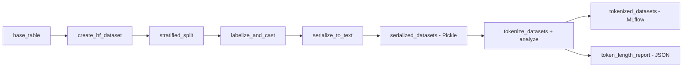

# Raw Data to Dataset Pipeline Specification

> **목표**: Split 파이프라인을 통해 raw data를 HuggingFace DatasetDict로 변환하고, 텍스트 직렬화 → 토큰화를 거쳐 MLflow Artifact로 저장한다.

---

## 1. 개요 및 설계 원칙

### 1.1 목적
- **Raw data** → **Split 파이프라인** → **HuggingFace DatasetDict** 생성
- **Train 파이프라인**: 텍스트 직렬화 → 토큰화 → MLflow Artifact 저장
- **Catalog 기반 I/O**: 모든 I/O는 catalog.yml로 관리
- **MLflow Hook 활용**: MlflowArtifactDataset + PickleDataset 조합

### 1.2 선행 조건
- `data/01_raw/dataset.parquet` 존재 확인
- Data Pipeline (ingestion → preprocess → feature) 실행 완료하여 `base_table` 생성
- MLflow 환경 설정 완료 (`conf/base/mlflow.yml`)

### 1.3 설계 원칙
- **I/O는 무조건 Catalog**: 노드는 객체만 반환, 저장은 Catalog가 담당
- **PickleDataset으로 DatasetDict 저장**: 로컬 data/ 하부에 pickle 저장
- **MLflow Hook 자동 업로드**: MlflowArtifactDataset이 자동으로 artifacts 폴더에 업로드
- **텍스트 직렬화와 토큰화 분리**: 디버깅 및 검증을 위해 중간 단계 분리

---

## 2. 파이프라인 구조

### 2.1 실행 순서


### 2.2 노드별 입출력

**Split 파이프라인**:

| 노드 | 입력 | 출력 | 역할 |
|------|------|------|------|
| `create_dataset` | `base_table`, `params:split` | `hf_dataset`, `label_names` | pandas DataFrame → HuggingFace Dataset 변환 |
| `to_hf_and_split` | `hf_dataset`, label_column, seed, test_size, val_size | `split_datasets_raw` | Train/Validation/Test 분할 (stratified) |
| `labelize_and_cast` | `split_datasets_raw`, `label_names`, label_column, num_proc | `split_datasets` | ClassLabel 스키마 적용 (정수 인코딩) |
| `serialize_to_text` | `split_datasets`, `params:train.serialization` | `serialized_datasets` | 특징 컬럼들을 텍스트로 직렬화 |

**Train 파이프라인**:

| 노드 | 입력 | 출력 | 역할 |
|------|------|------|------|
| `tokenize_datasets` | `serialized_datasets`, `params:train.tokenization` | `tokenized_datasets`, `token_length_report` | 텍스트 토큰화 + 토큰 길이 분석 통합 |

---

## 3. Catalog 설정

### 3.1 Split 파이프라인 출력
```yaml
# catalog.yml
serialized_datasets:
  type: kedro.io.PickleDataset
  filepath: data/05_model_input/serialized_datasets.pkl
```

**스키마**:
- `text`: string (직렬화된 특징 컬럼)
- `labels`: int (ClassLabel 정수)

### 3.2 Train 파이프라인 출력 (MLflow Artifact)
```yaml
# catalog.yml
tokenized_datasets:
  type: kedro_mlflow.io.artifacts.MlflowArtifactDataset
  dataset:
    type: kedro.io.PickleDataset
    filepath: data/06_models/tokenized_datasets.pkl
  artifact_path: data/tokenized_datasets

token_length_report:
  type: kedro.io.json.JSONDataset
  filepath: data/08_reporting/token_length_report.json
```

**tokenized_datasets 스키마**:
- `input_ids`: List[int] (토큰 ID 시퀀스)
- `attention_mask`: List[int] (패딩 마스크)
- `labels`: int (ClassLabel 정수)

**token_length_report 구조**:
```json
{
  "overall": {
    "count": 10000,
    "mean": 245.3,
    "max": 512,
    "min": 45,
    "p50": 230,
    "p75": 290,
    "p90": 380,
    "p95": 450,
    "p99": 510
  },
  "per_split": {
    "train": {"count": 7000, "mean": 243.1, "max": 512, "min": 45},
    "validation": {"count": 1000, "mean": 248.5, "max": 505, "min": 50},
    "test": {"count": 2000, "mean": 247.2, "max": 498, "min": 48}
  },
  "model_name": "Qwen/Qwen3-4B",
  "max_length_config": 512
}
```

### 3.3 MLflow Run ID 기반 저장 검증
```bash
# 예상 MLflow 아티팩트 구조
mlruns/{experiment_id}/{run_id}/artifacts/
└── data/
    └── tokenized_datasets.pkl
```

---

## 4. 노드 설계 (Split 파이프라인)

### 4.1 텍스트 직렬화 노드 (serialize_to_text)
```python
def serialize_to_text(
    split_datasets: DatasetDict,
    serialization_params: Dict[str, Any]
) -> DatasetDict:
    """
    특징 컬럼들을 텍스트로 직렬화 (디버깅 및 검증용)

    Args:
        split_datasets: Split 파이프라인 출력 (특징 컬럼 + labels)
        serialization_params: training.yml의 train.serialization

    Returns:
        serialized_datasets: text 컬럼 + labels
    """
    text_columns = serialization_params.get("text_columns", [])
    separator = serialization_params.get("separator", ", ")
    include_column_names = serialization_params.get("include_column_names", True)
    num_proc = serialization_params.get("num_proc", 4)

    def serialize_function(examples):
        if text_columns:
            cols = text_columns
        else:
            # labels, acct_code 제외한 모든 컬럼
            cols = [c for c in examples.keys() if c not in ["labels", "acct_code"]]

        texts = []
        for i in range(len(examples[cols[0]])):
            if include_column_names:
                parts = [f"{col}: {examples[col][i]}" for col in cols]
            else:
                parts = [str(examples[col][i]) for col in cols]
            texts.append(separator.join(parts))

        return {"text": texts}

    serialized = split_datasets.map(
        serialize_function,
        batched=True,
        num_proc=num_proc,
        remove_columns=[c for c in split_datasets["train"].column_names if c not in ["labels"]]
    )

    return serialized
```

## 5. 노드 설계 (Train 파이프라인)

### 5.1 토큰화 + 분석 노드 (tokenize_datasets)
```python
def tokenize_datasets(
    serialized_datasets: DatasetDict,
    tokenization_params: Dict[str, Any]
) -> Tuple[DatasetDict, Dict[str, Any]]:
    """
    텍스트 토큰화 및 토큰 길이 분석 통합 수행

    Args:
        serialized_datasets: text 컬럼을 포함한 DatasetDict
        tokenization_params: training.yml의 train.tokenization

    Returns:
        (tokenized_datasets, token_length_report):
        - tokenized_datasets: input_ids, attention_mask, labels 포함
        - token_length_report: 토큰 길이 통계 (overall, per_split)
    """
    from transformers import AutoTokenizer
    import numpy as np

    model_name = tokenization_params["model_name"]
    max_length = tokenization_params["max_length"]
    truncation = tokenization_params["truncation"]
    padding = tokenization_params["padding"]
    num_proc = tokenization_params.get("num_proc", 4)

    tokenizer = AutoTokenizer.from_pretrained(model_name)

    def tokenize_function(examples):
        return tokenizer(
            examples["text"],
            max_length=max_length,
            truncation=truncation,
            padding=padding
        )

    # 토큰화
    tokenized = serialized_datasets.map(
        tokenize_function,
        batched=True,
        num_proc=num_proc,
        remove_columns=["text"]
    )

    # 토큰 길이 분석 (통합)
    all_lengths = []
    per_split_stats = {}

    for split_name in tokenized.keys():
        token_lengths = [len(ids) for ids in tokenized[split_name]["input_ids"]]
        all_lengths.extend(token_lengths)

        per_split_stats[split_name] = {
            "count": len(token_lengths),
            "mean": float(np.mean(token_lengths)),
            "max": int(np.max(token_lengths)),
            "min": int(np.min(token_lengths)),
        }

    # Overall 통계 + percentiles
    overall_stats = {
        "count": len(all_lengths),
        "mean": float(np.mean(all_lengths)),
        "max": int(np.max(all_lengths)),
        "min": int(np.min(all_lengths)),
        "p50": float(np.percentile(all_lengths, 50)),
        "p75": float(np.percentile(all_lengths, 75)),
        "p90": float(np.percentile(all_lengths, 90)),
        "p95": float(np.percentile(all_lengths, 95)),
        "p99": float(np.percentile(all_lengths, 99)),
    }

    token_length_report = {
        "overall": overall_stats,
        "per_split": per_split_stats,
        "model_name": model_name,
        "max_length_config": max_length,
    }

    return tokenized, token_length_report
```

---

## 6. 파라미터 구성

### 6.1 Split 파라미터 (training.yml)
```yaml
split:
  label_column: acct_code          # 분류 대상 라벨
  seed: 42                         # 재현성
  test_size: 0.2                   # 테스트 비율 (20%)
  val_size: 0.1                    # 검증 비율 (10%)
  max_classes: 1000                # 최대 클래스 수
  dummy_prefix: dummy              # Dummy 라벨 접두사
  dummy_label: dummy1              # 기본 Dummy 라벨
  labelize_num_proc: 4             # ClassLabel 병렬 처리
```

### 6.2 텍스트 직렬화 파라미터 (training.yml)
```yaml
train:
  serialization:
    text_columns: []               # 빈 리스트 = 모든 특징 컬럼 (labels, acct_code 제외)
    separator: ", "                # 컬럼 구분자
    include_column_names: true     # "col_name: value" 형식
    num_proc: 4                    # 병렬 처리
```

### 6.3 토큰화 파라미터 (training.yml)
```yaml
train:
  tokenization:
    model_name: "bert-base-uncased"
    max_length: 512
    truncation: true
    padding: false                 # Dynamic padding (DataCollator 사용)
    num_proc: 4
```

---

## 7. 실행 및 검증 절차

### 7.1 실행 명령
```bash
# 1단계: Data Pipeline 실행 (base_table 생성)
kedro run --pipeline=data_prep

# 2단계: Split Pipeline 실행 (텍스트 직렬화까지)
kedro run --pipeline=split

# 3단계: Train Pipeline 실행 (토큰화 + 분석 → MLflow 저장)
kedro run --pipeline=train
```

### 7.2 파일 생성 검증
```bash
# Split 파이프라인 출력 확인 (Pickle)
ls -lh data/05_model_input/serialized_datasets.pkl

# Train 파이프라인 출력 확인
ls -lh data/06_models/tokenized_datasets.pkl
ls -lh data/08_reporting/token_length_report.json
```

### 7.3 MLflow 아티팩트 검증
```bash
# 최신 Run ID 확인
kedro mlflow ui
# 또는
ls -lt mlruns/1/  # experiment_id=1 가정

# Run ID 디렉토리에서 아티팩트 확인 (Train 파이프라인만)
ls -lh mlruns/1/{run_id}/artifacts/data/tokenized_datasets.pkl
```

### 7.4 데이터 품질 검증 (Python)
```python
import pickle
from kedro.framework.session import KedroSession
from kedro.framework.startup import bootstrap_project

# Kedro 세션 시작
bootstrap_project("/path/to/account-tax")
session = KedroSession.create()
context = session.load_context()

# Split 파이프라인 출력 로드
serialized_datasets = context.catalog.load("serialized_datasets")

# 텍스트 직렬화 검증
for split in ["train", "validation", "test"]:
    print(f"\n=== {split.upper()} Serialized ===")
    ds = serialized_datasets[split]
    print(f"Shape: {ds.num_rows} rows, {ds.num_columns} columns")
    print(f"Features: {ds.features}")
    print(f"Sample text: {ds[0]['text'][:200]}...")

# Train 파이프라인 출력 로드
tokenized_datasets = context.catalog.load("tokenized_datasets")
token_report = context.catalog.load("token_length_report")

# 토큰화 검증
for split in ["train", "validation", "test"]:
    print(f"\n=== {split.upper()} Tokenized ===")
    ds = tokenized_datasets[split]
    print(f"Shape: {ds.num_rows} rows")
    print(f"Features: {ds.features}")
    print(f"Input IDs length: {len(ds[0]['input_ids'])}")
    print(f"Sample: {ds[0]}")

# 토큰 길이 리포트 확인
print(f"\n=== Token Length Report ===")
print(f"Overall mean: {token_report['overall']['mean']:.1f}")
print(f"Overall p95: {token_report['overall']['p95']:.1f}")
print(f"Per split stats: {token_report['per_split']}")
```

### 7.5 검증 체크리스트
- [ ] `data/05_model_input/serialized_datasets.pkl` 파일 생성 확인
- [ ] `data/06_models/tokenized_datasets.pkl` 파일 생성 확인
- [ ] `data/08_reporting/token_length_report.json` 파일 생성 확인
- [ ] MLflow Run ID 디렉토리에 tokenized_datasets.pkl 아티팩트 생성 확인
- [ ] Serialized DatasetDict의 `text` 컬럼 내용 검증 (토큰화 전)
- [ ] Tokenized DatasetDict에 `input_ids`, `attention_mask`, `labels` 포함 확인
- [ ] Token length report에 overall/per_split 통계 포함 확인
- [ ] Train/Validation/Test 분할 비율 확인 (70/10/20 예상)

---

## 8. 오류 처리 및 트러블슈팅

### 8.1 예상 이슈
| 이슈 | 원인 | 해결 방안 |
|------|------|----------|
| `base_table` 없음 | Data Pipeline 미실행 | `kedro run --pipeline=data_prep` 먼저 실행 |
| DatasetDict 로드 실패 | Arrow 파일 손상 | 디렉터리 삭제 후 Split 파이프라인 재실행 |
| MLflow 아티팩트 없음 | Train 파이프라인 미실행 | Split 이후 Train 파이프라인 실행 필요 |
| ClassLabel 적용 실패 | `label_names` 누락 | `create_hf_dataset` 노드 출력 확인 |
| 메모리 부족 | 대용량 데이터셋 | `num_proc` 감소 또는 배치 크기 조정 |
| Tokenizer 로드 실패 | 모델명 오류 | `train.tokenization.model_name` 검증 |

### 8.2 로깅 활성화
```yaml
# conf/base/logging.yml
loggers:
  account_tax.pipelines.split:
    level: DEBUG
  account_tax.pipelines.train:
    level: DEBUG
```

---

## 8. 파이프라인 연계

### 8.1 데이터 흐름도

```mermaid
graph LR
    A[base_table] -->|Split Pipeline| B[DatasetDict - Arrow]
    B -->|save_to_disk| C[data/05_model_input/hf_dataset]
    C -->|Train Pipeline - load_from_disk| D[DatasetDict]
    D -->|tokenize| E[Tokenized DatasetDict]
    E -->|save_to_disk + MLflow| F[data/06_models/tokenized_datasets]
    F -->|Trainer| G[trained_model]
```


### 8.2 Split 파이프라인 산출물
```python
# Split Pipeline 최종 출력
split_datasets = DatasetDict({
    'train': Dataset(features={'feature1': ..., 'labels': ClassLabel(...)}),
    'validation': Dataset(...),
    'test': Dataset(...)
})
# 저장: split_datasets.save_to_disk("data/05_model_input/hf_dataset")
```

### 8.3 Train 파이프라인 입력
```python
# Train Pipeline 시작
from datasets import load_from_disk

split_datasets = load_from_disk("data/05_model_input/hf_dataset")
# → tokenize_datasets() → prepare_for_trainer()
```

---

## 9. 성공 기준

### 9.1 파일 생성
- [ ] `data/05_model_input/hf_dataset/` (DatasetDict - Arrow 포맷)
- [ ] `data/06_models/tokenized_datasets/` (Tokenized DatasetDict - Arrow 포맷)
- [ ] `mlruns/{exp_id}/{run_id}/artifacts/data/tokenized_datasets/`

### 9.2 데이터 품질
- [ ] Split DatasetDict: `labels` 컬럼이 ClassLabel 타입
- [ ] Tokenized DatasetDict: `input_ids`, `attention_mask`, `labels` 포함
- [ ] ClassLabel 스키마 적용 (0-based integer encoding)
- [ ] Train/Validation/Test 분할 비율 검증

### 9.3 재현성
- [ ] 동일한 `seed` 값으로 재실행 시 동일한 결과 생성
- [ ] MLflow Run ID별로 독립적인 아티팩트 관리

---

## 10. 구현 계획

### 10.1 Split 파이프라인 수정
1. **노드 정리**: `serialize_for_nlp`, `export_prepared_partitions`, `export_text_partitions` 제거
2. **파이프라인 구조**: `create_hf_dataset` → `stratified_split`
3. **Catalog 설정**: `split_datasets` → PickleDataset

### 10.2 Train 파이프라인 수정
1. **신규 노드 추가**:
   - `serialize_to_text`: 특징 컬럼 → 텍스트 직렬화 (디버깅용)
   - `tokenize_datasets`: 텍스트 → 정수 토큰 변환
2. **기존 노드 제거**: `prepare_for_trainer` (저장은 Catalog가 자동 처리)
3. **파이프라인 구조**: `serialize_to_text` → `tokenize_datasets`
4. **Catalog 설정**:
   - `serialized_datasets` → PickleDataset (로컬만)
   - `tokenized_datasets` → MlflowArtifactDataset(PickleDataset) (MLflow 업로드)

### 10.3 Catalog 수정
```yaml
# 제거
- prepared_datasets_mlflow
- text_datasets_mlflow
- prepared_datasets (PartitionedParquetDataset)
- text_datasets (PartitionedParquetDataset)

# 추가
+ split_datasets (PickleDataset)
+ serialized_datasets (PickleDataset)
+ tokenized_datasets (MlflowArtifactDataset + PickleDataset)
```

### 10.4 Parameters 수정
```yaml
# split - 변경 없음 (output_path 제거)

# train.serialization - 유지 (retain_columns 제거)
train:
  serialization:
    text_columns: []
    separator: ", "
    include_column_names: true
    num_proc: 4

# train.tokenization - 유지 (output_path 제거)
train:
  tokenization:
    model_name: "bert-base-uncased"
    max_length: 512
    truncation: true
    padding: false
    num_proc: 4
```

### 10.5 datasets 폴더 삭제
- `/account-tax/src/account_tax/datasets` 디렉터리 완전 삭제
- 커스텀 Dataset 클래스 사용 안 함

---

본 문서는 **Catalog 기반 I/O + MLflow Hook 활용** 원칙에 따라 Split/Train 파이프라인을 재설계하며, PickleDataset으로 DatasetDict를 저장하고 MLflow Artifact로 자동 업로드하는 구조를 정의한다.