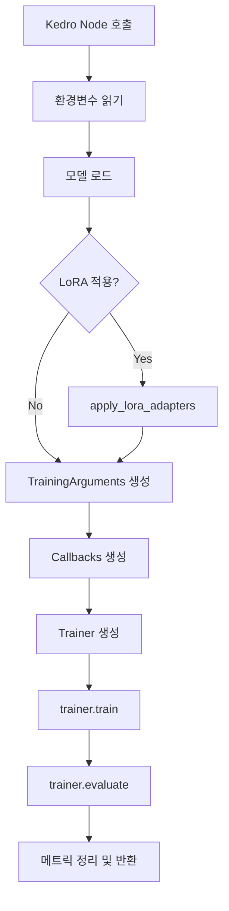

# Train "BlueScreen" Design Specification

설계자는 본 문서를 기준으로 학습 파이프라인을 **단일 Kedro 노드**로 구현하며, 내부에서 DeepSpeed Stage 2 + LoRA Fine-tuning을 수행한다. 기존 `backup/src/model_training`은 참고만 하고, 새로운 경량 스크립트를 작성한다.

---

## 1. 범위 & 목표
- **토크나이즈 완료된 HuggingFace `DatasetDict`** 입력을 받아 멀티 GPU 학습을 수행한다.
- DeepSpeed Stage 2 + LoRA를 적용하고 HuggingFace `Trainer`를 사용한다.
- MLflow Run과 연동하여 rank 0에서만 메트릭/아티팩트를 기록한다.
- 학습 결과(메트릭)를 Kedro 파이프라인에 전달한다.

---

## 2. Kedro 노드 계약

| 항목 | 설명 |
|------|------|
| 노드 이름 | `run_deepspeed_training` |
| 입력 | - `tokenized_datasets`: 토크나이즈된 `DatasetDict` (train/validation/test split 포함) - **Catalog 객체**<br>- `tokenizer`: HuggingFace `Tokenizer` - **Catalog 객체**<br>- `train_params`: `training.yml`의 `train` 섹션 (deepspeed/lora/training 서브 키 포함)<br>- `artifacts_root`: 체크포인트/메타데이터 저장 루트 경로 (str) |
| 출력 | - `training_metrics`: 주요 학습/평가 지표 dict (accuracy/f1/loss 등) - **Catalog에 등록** |
| 부수효과 | - MLflow에 학습/평가 지표 자동 로깅 (Trainer 통합)<br>- `artifacts_root/`에 모델 체크포인트 저장 (향후 구현) |

### Catalog 등록 예시
```yaml
# catalog.yml
tokenized_datasets:
  type: datasets.DatasetDict
  filepath: data/04_feature/tokenized_datasets
  versioned: true

tokenizer:
  type: pickle.PickleDataset
  filepath: data/04_feature/tokenizer.pkl
  versioned: true

training_metrics:
  type: json.JSONDataset
  filepath: data/06_models/training_metrics.json
```

---

## 3. 워크플로우 (동작 순서)



---

## 4. 핵심 함수 정의

아래 함수들은 `account_tax/src/account_tax/pipelines/train/training_core.py` 내에 위치한다.

| 함수/클래스 | 입력 | 출력 | 역할 |
|-------------|------|------|------|
| `run_training_pipeline(tokenized_datasets, tokenizer, train_params, artifacts_root)` | Catalog 객체들, 파라미터 dict, 경로 | `dict` (metrics_summary) | **메인 진입점**: 전체 워크플로우를 순차 실행하는 Kedro 노드 함수 |
| `instantiate_model(model_config, tokenizer)` | 모델 구성 dict, Tokenizer | `PreTrainedModel` | HF 모델 로드, `num_labels`, `gradient_checkpointing`, dtype 설정 |
| `apply_lora_adapters(model, lora_params)` | 모델, LoRA 구성 dict | 모델 (PEFT 적용) | PEFT `LoraConfig` 생성 및 `get_peft_model()` 호출, 학습 파라미터 수 출력 |
| `build_training_arguments(train_params, artifacts_root)` | 학습 구성 dict, 출력 경로 | `TrainingArguments` | DeepSpeed dict 직접 전달, eval/save interval, `report_to=['mlflow']`, mixed precision 설정 |
| `compute_metrics(eval_pred)` | `EvalPrediction` | dict | accuracy, f1, precision, recall 계산 (HuggingFace `evaluate` 라이브러리 사용) |

### Callback 클래스

| 클래스 | 역할 |
|--------|------|
| `SpeedCallback` | step 단위로 tokens/sec 측정 후 rank 0에서 MLflow에 `speed/tokens_per_sec` 로그 |
| `TorchMemoryCallback` | step/eval 끝에서 rank 0 GPU 메모리 사용량 로깅 (`gpu/alloc_mb`, `gpu/max_alloc_mb`) |

### 보조 함수
- `is_rank0()`: `int(os.environ.get("RANK", os.environ.get("LOCAL_RANK", 0))) == 0`
- `get_mlflow_env()`: `MLFLOW_RUN_ID`, `MLFLOW_TRACKING_URI` 환경변수 확인

---

## 5. Configuration Schema (`training.yml`)

```yaml
train:
  model:
    name: "bert-base-uncased"           # HuggingFace model ID
    num_labels: 10                      # 분류 클래스 수

  deepspeed:
    # DeepSpeed Stage 2 설정 (dict로 TrainingArguments에 직접 전달)
    train_micro_batch_size_per_gpu: 8
    gradient_accumulation_steps: 4
    zero_optimization:
      stage: 2
      offload_optimizer:
        device: cpu
        pin_memory: true
      allgather_partitions: true
      allgather_bucket_size: 2e8
      overlap_comm: true
      reduce_scatter: true
      reduce_bucket_size: 2e8
      contiguous_gradients: true
    gradient_clipping: 1.0
    wall_clock_breakdown: true

  lora:
    enable: true
    r: 8                                # LoRA rank
    alpha: 32                           # LoRA alpha (scaling factor)
    target_modules: ["query", "value"]  # 적용할 attention 레이어
    dropout: 0.05
    bias: "none"                        # "none" | "all" | "lora_only"
    task_type: "SEQ_CLS"                # CAUSAL_LM | SEQ_CLS | SEQ_2_SEQ_LM

  training:
    output_dir: "data/06_models/checkpoints"
    num_train_epochs: 3
    max_steps: null                     # null이면 epochs 사용
    eval_strategy: "steps"              # "steps" | "epoch"
    eval_steps: 500
    save_strategy: "steps"
    save_steps: 1000
    save_total_limit: 3                 # 최대 체크포인트 개수
    logging_steps: 10
    learning_rate: 2.0e-5
    weight_decay: 0.01
    warmup_ratio: 0.1
    fp16: false
    bf16: true                          # A100/H100에서 권장
    gradient_checkpointing: true
    dataloader_num_workers: 4
    seed: 42
    report_to: ["mlflow"]               # MLflow 자동 로깅
    load_best_model_at_end: true
    metric_for_best_model: "f1"
    greater_is_better: true
```

### DeepSpeed dict 전달 방식
```python
# TrainingArguments 생성 시
training_args = TrainingArguments(
    deepspeed=train_params["deepspeed"],  # dict 직접 전달 (JSON 파일 불필요)
    ...
)
```

---

## 6. LoRA 적용 방식 (PEFT 명시적 사용)

### 구현 예시
```python
from peft import get_peft_model, LoraConfig, TaskType

def apply_lora_adapters(model, lora_params):
    """LoRA 적용 (PEFT 라이브러리 사용)"""

    lora_config = LoraConfig(
        r=lora_params["r"],
        lora_alpha=lora_params["alpha"],
        target_modules=lora_params["target_modules"],
        lora_dropout=lora_params["dropout"],
        bias=lora_params["bias"],
        task_type=TaskType[lora_params["task_type"]]
    )

    model = get_peft_model(model, lora_config)

    # rank 0에서만 학습 파라미터 수 출력
    if is_rank0():
        model.print_trainable_parameters()
        # 출력 예: trainable params: 294,912 || all params: 109,483,778 || trainable%: 0.27%

    return model
```

### 장점
- ✅ `target_modules` 명시적 제어 (query, key, value, dense 등)
- ✅ `model.print_trainable_parameters()`로 파라미터 수 확인
- ✅ LoRA adapter만 저장 (수 MB) → `model.save_pretrained()`
- ✅ DeepSpeed Stage 2와 호환성 검증됨
- ✅ HuggingFace 공식 표준 방식

---

## 7. MLflow 로깅 전략

### 환경변수 기반 연동
```python
def get_mlflow_env():
    """MLflow 환경변수 확인"""
    return {
        "run_id": os.environ.get("MLFLOW_RUN_ID"),
        "tracking_uri": os.environ.get("MLFLOW_TRACKING_URI"),
        "experiment_name": os.environ.get("MLFLOW_EXPERIMENT_NAME")
    }
```

- Kedro MLflow Hook이 자동으로 환경변수 설정
- Trainer의 `report_to=["mlflow"]`가 자동으로 현재 run에 로깅
- 별도 `mlflow.start_run()` 호출 불필요

### 자동 로깅 지표
**학습 지표** (Trainer 자동):
- `train/loss`, `train/learning_rate`, `train/epoch`, `train/global_step`

**평가 지표** (compute_metrics):
- `eval/loss`, `eval/accuracy`, `eval/f1`, `eval/precision`, `eval/recall`

**커스텀 지표** (Callbacks):
- `speed/tokens_per_sec` (SpeedCallback)
- `gpu/alloc_mb`, `gpu/max_alloc_mb` (TorchMemoryCallback)

**DeepSpeed 지표** (옵션):
- `time/forward_ms`, `time/backward_ms`, `time/step_ms` (wall_clock_breakdown: true 시)

**모든 로깅은 `if is_rank0():` 조건 하에 실행**

---

## 8. 오류 처리

### 예외 처리 원칙
1. **데이터 로드 실패**: Catalog에서 자동 예외 발생 → Kedro 노드 실패
2. **모델 로드 실패**: `AutoModel.from_pretrained()` 예외 → 즉시 전파
3. **학습 중 예외**: Trainer가 자동 처리, DeepSpeed engine 종료

### 체크포인트 재시작 (향후 구현)
```python
# 향후 추가 예정
checkpoint_path = os.path.join(artifacts_root, "checkpoints/latest")
if os.path.exists(checkpoint_path):
    trainer.train(resume_from_checkpoint=checkpoint_path)
else:
    trainer.train()
```

---

## 9. 개발 체크리스트

### Phase 1: 핵심 구현
- [ ] `account_tax/src/account_tax/pipelines/train/training_core.py` 생성
- [ ] 5개 핵심 함수 구현
  - [ ] `run_training_pipeline()` (메인 진입점)
  - [ ] `instantiate_model()`
  - [ ] `apply_lora_adapters()`
  - [ ] `build_training_arguments()`
  - [ ] `compute_metrics()`
- [ ] 2개 Callback 클래스 구현
  - [ ] `SpeedCallback`
  - [ ] `TorchMemoryCallback`

### Phase 2: 통합
- [ ] `training.yml` 작성 (위 schema 기준)
- [ ] `catalog.yml`에 `training_metrics` 추가
- [ ] `train/pipeline.py`에 노드 등록
- [ ] `pipeline_registry.py`에 `train` 파이프라인 추가

### Phase 3: 테스트
- [ ] 단일 GPU 동작 확인 (`CUDA_VISIBLE_DEVICES=0`)
- [ ] 멀티 GPU 동작 확인 (DeepSpeed launcher)
- [ ] MLflow UI에서 지표 확인
- [ ] LoRA adapter 저장 확인 (수 MB)

### 실행 명령
```bash
# 단일 GPU
kedro run --pipeline=train

# 멀티 GPU (DeepSpeed)
deepspeed --num_gpus=2 -m kedro run --pipeline=train
```

---

## 10. 향후 확장

### 단기 (Phase 2)
- 체크포인트 재시작 기능
- `model_metadata.json`, `dataset_metadata.json` 저장
- Best model 복사 로직

### 중기
- DeepSpeed Stage 3 지원
- ZeRO Offload 옵션
- Gradient checkpointing 최적화

### 장기
- 추론 파이프라인과 메타데이터 연동
- 다중 모델 실험 비교 (MLflow tags)
- 하이퍼파라미터 튜닝 통합 (Optuna + MLflow)

---

## 11. 설계 결정 요약

| 항목 | 결정 사항 | 근거 |
|------|----------|------|
| 입출력 | Catalog 객체 전달 | Kedro 표준 방식, 버전 관리 지원 |
| MLflow 연동 | 환경변수 직접 읽기 | Hook 자동 설정, 코드 단순화 |
| DeepSpeed 설정 | dict 직접 전달 | JSON 파일 불필요, 동적 수정 가능 |
| LoRA 적용 | PEFT 명시적 사용 | 표준 방식, DeepSpeed 호환 보장 |
| 함수 구조 | 5개 핵심 함수 | 불필요한 추상화 제거 |
| Callback | SpeedCallback + TorchMemoryCallback | 커스텀 지표 로깅 |
| 체크포인트 | Phase 1 제외 | 복잡도 감소, 향후 추가 |

---

본 문서를 기반으로 개발자는 학습 파이프라인을 구현할 수 있으며, DeepSpeed Stage 2 + LoRA + Trainer 조합의 핵심 요소가 명확히 정의되어 있다.